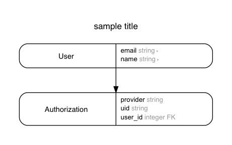

# Open-Signs API

[](https://travis-ci.org/deafchi/opensigns-api)

```
rvm install ruby-2.4.1
bundle install
rails s
```

This uses the latest stable ruby (at time of writing) along with rails 5.1. Grape is set up.



## RSpec

Generate with `rails generate rspec:install` once. From now on, test with

```
bundle exec rspec
```

## Database Migrations

Always run `rake db:migrate` before you make changes to anything.

## ERD

To generate an ERD file, run

```
bundle exec erd
```

Make sure you migrate the database entirely.
